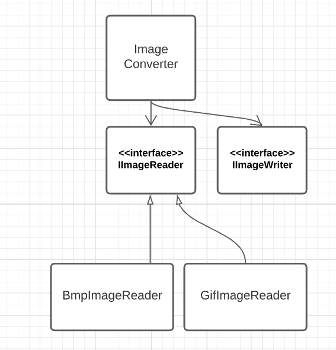

## 2. Image formats

Необхідно спроектувати і написати консольну програму, яка конвертує зображення між різними форматами та приймає наступні аргументі командного рядка:

- `--source` - вхідний файл для конвертації (шлях до файлу)
- `--goal-format` - вихідний формат для конвертації (напр. Png або Bmp32)
- `--output` - шлях до результату (за замовчуванням використовується ім'я та шлях оригінального файлу з новим розширенням)

Приклад виклику програми:
```
> Converter.exe --source=example.jpg --goal-format=png
```

Зверніть увагу, що тип вхідного файлу не вказується і має обратися автоматично. Невиконання цієї умови буде помилкою.

Крім того, програма має обробляти ситуацію спроби відкриття некоректного файлу (файлу з невідомим форматом або з некоректним вмістом) і не завершувати роботу аварійно, а виводити повідомлення про помилку. Наприклад: `Error: you are trying to open .tiff file, but only .bmp and . gif files are supported`, або `Error: you trying to open 8bit BMP file, but only BMP32 is supported`

Для здачі роботи потрібно реалізувати щонайменше два різні формати файлів (на вибір) – різні формати мають різну складність і тому оцінюються в різну кількість балів. Читання і запис кожного формату вважається окремою частиною і оцінюється окремо. Наприклад, якщо за реалізацію формату PPM передбачено 2 бали, то це 1 бал за можливість читання файлів цього формату і 1 бал за можливість запису. Варіанти форматів (оцінювання кожного варіанту нижче):
1. **PPM (portable pixmap format) P3** – найпростіший *текстовий* формат для зберігання зображення. Файл містить в собі заголовок, що складається з формату, ширини та довжини зображення в пікселях та максимального значення кожної кольорової компоненти _M_. Після цього у файлі знаходяться трійки значень RGB у діапазоні [0, _M_] для кожного пікселя зображення. Приклад файлу:
```
    P3
    # Image with width 3 and height 2,
    # using 0 or 1 per color (red, green, blue)
    3 2 1
    1 0 0   0 1 0   0 0 1
    1 1 0   1 1 1   0 0 0
```
Формат використовується переважно як допоміжний або проміжний при роботі з іншими типами файлів, детальніше можна почитати у [вікі](https://en.wikipedia.org/wiki/Netpbm#File_formats) або безпосередньо у [специфікації формату](http://netpbm.sourceforge.net/doc/ppm.html). Існує також бінарний варіант такого файлу P6.

2. **BMP (bitmap image file) uncompressed** – простий та дуже розповсюджений формат, має багато варіацій збереження файлів (різна кількість байт на піксель, можливість стискання тощо). Більш детально можна почитати в [описі роботи для першого курсу](https://github.com/ProgramEngineeringKPI/Introduction-To-Programming/blob/master/labs_spring_2021/assignment_4.md), там же можна знайти багато посилань на опис формату. Реалізовувати підтримку палітр, стиснутих файлів та grayscale зображень не обов'язково, це не є частиною завдання.
3. **GIF (Graphics Interchange Format)** – популярний на початку розвитку інтернету формат, підтримує анімації, має менший розмір ніж BMP за рахунок використання стискання [Lempel-Ziv-Welch](https://en.wikipedia.org/wiki/Lempel%E2%80%93Ziv%E2%80%93Welch). На сьогодні використовується переважно для анімованих [мемів](https://giphy.com/). Детальніше - [вікі](https://en.wikipedia.org/wiki/GIF), [детальна структура](https://www.fileformat.info/format/gif/egff.htm), [повний розбір написання парсера](https://commandlinefanatic.com/cgi-bin/showarticle.cgi?article=art011) (зауважте, що вам не треба писати алгоритм пакування/розпакування). Реалізовувати підтримку анімацій та писати алгоритм LZW не обов'язково.
4. **PNG (Portable Network Graphics)** – алгоритм, що поступово витіснив GIF у вебі за рахунок більших можливостей у передачі кольорів, прозорості та кращому (у більшості випадків) стисненню змісту. Детальніше можна почитати у [вікі](https://en.wikipedia.org/wiki/Portable_Network_Graphics) та на [домашньому сайті формату](http://www.libpng.org/pub/png/)(і таке буває). 
5. **JPEG (Joint Photographic Experts Group)** – широко розповсюджений, але і найскладніший (використовує один із видів дискретного перетворення Фур'є) із запропонованих варіант. Специфіка алгоритму з втратами призводить до появи видимих артефактів у місцях різкого переходу кольорів, тому найбільше використовується для зображень де такі переходи малопомітні або їх немає – наприклад, цифрові фотографії. Детальніше – [стаття](https://www.freecodecamp.org/news/how-jpg-works-a4dbd2316f35/), [ще стаття](https://arjunsreedharan.org/post/146070390717/jpeg-101-how-does-jpeg-work#:~:text=JPEG%20is%20a%20lossy%20compression,we%20do%20brightness%20(luminance).), [кодування Хафмана](https://www.impulseadventure.com/photo/jpeg-huffman-coding.html), [вікі](https://en.wikipedia.org/wiki/JPEG).


Крім власне роботи з форматами, коректна програма має бути побудована за принципом плагінів: високорівневий код перетворення файлів не має оперувати конкретними реалізаціями форматів, а тільки абстракціями. Іншими словами, не дозволяється прямого використання `using` або `import` модулів конкретних форматів в програмі-конверторі більше ніж в одному місці (фабриці). 

Приклад можливої структури класів у ООП-мові:



В даному випадку програма на високому рівні оперує інтерфейсами `IImageReader` та `IImageWriter`, не знаючи які саме формати в даний момент підтримуються. Підключення формату-плагіна можливе через об'єкт фабрику, який єдиний буде знати про всі існуючі формати. В залежності від обраної мови програмування вам доведеться самостійно обрати механізм реалізації підключення плагінів, оскільки деякі мови можуть по-різному виражати динамічний поліморфізм.

Для отримання балу за динамічне завантаження плагінів, необхідно написати фабрику конкретних типів IImageReader/IImageWriter, яка завантажує реалізації цих типів в рантаймі із бібліотек, що можуть лежати в підпапці зі скомпільованою програмою. При цьому вона не має знати наперед, які плагіни там можуть знаходитись. Наприклад:

```
image-converter/
├── plugins/
│   ├── Reader.JPG.dll
│   └── Writer.Bitmap.dll
└── Converter.exe
```

Тут ваша програма має прочитати всі dll файли (це приклад лише для windows, якщо ви використовуєте іншу ОС або мову, що не може скомпілювати dll файли, скористайтеся іншими рівноцінними варіантами), що лежать в папці plugins, знайти в них реалізації необхідних інтерфейсів і в подальшому використати їх для перетворення зображень. 

Одразу зверніть увагу, що інтерфейси крім власне читання/запису мусять мати методи, що дозволять програмі визначити, який тип файлів плагін може записувати, а також визначити чи може плагін прочитати певний файл – оскільки при читанні тип файлу не вказується. Для останнього достатньо буде, щоб плагін швидко перевірив початок файлу на наявність потрібного заголовку.

### Примітки
- В багатьох мовах для завантаження плагінів під час виконання використовується рефлексія (C#/Java) або [API операційної системи](https://cplusplus.com/articles/48TbqMoL/) (С++). В багатьох випадках ви можете використовувати тільки плагіни, написані тією ж мовою або принаймні на тій же платформі ([CLI](https://en.wikipedia.org/wiki/Common_Language_Infrastructure)), хоча є виключення, наприклад [P/Invoke в .NET](https://learn.microsoft.com/en-us/dotnet/standard/native-interop/pinvoke) або [bindings в python](https://realpython.com/python-bindings-overview/). В цій роботі ви можете користуватися лише найпростішим варіантом, коли плагіни виконані тією ж мовою, що і основна програма.
- В наступних роботах ми будемо використовувати зображення різних інших, більш складних форматів, і тому будемо користуватися готовими бібліотеками. В цій роботі читання/запис файлів різних форматів потрібно реалізувати самостійно (крім алгоритмів стиснення сімейства LZ у PNG та GIF).
- Читати файл з диску має ваша програма, а не плагін. Він має працювати уже з прочитаним вмістом, наприклад у вигляді масиву байтів.
- В подальшому ви зможете використовувати плагіни, написані іншими командами. Очевидно, що для цього вони всі мають реалізовувати одні й ті самі інтерфейси. Це не є обов'язковою умовою, проте ви можете заздалегідь потурбуватися про уніфікацію і використання різними командами одних і тих самих інтерфейсів.


### Оцінювання:
Максимум за роботу можна отримати _6 балів_ + 6 додаткових балів. 
1. Коректне проектування залежностей між основною програмою, плагінами та фабрикою – _1 бал_. 1 бал дається за динамічне завантаження плагінів
2. Алгоритм PPM - _1.5 бали_;
3. Алгоритм BMP - _2 бали_;
4. Алгоритм PNG або GIF (з використанням бібліотеки для стиснення) - _4 бали_ . _+1 бал_ за самостійну реалізацію LZW. Не рекомендую вибирати запис gif через складнощі з вибором палітр.
5. Алгоритм JPEG - _6 балів_. Будь-ласка, лишіть цей пункт лише на той випадок, якщо ви справді впевнені в своїх силах, і якщо у вас є багато вільного часу.

Найпростіший спосіб отримати _майже_ 60% за роботу: виконати 1 пункт на 1 бал, читання формату bmp на 1 бал та запис/читання формату ppm на 1.5 бали.

Найпростіший спосіб отримати 100%, але без додаткових балів: виконати 1 пункт на 2 бали, читання/запис bmp на 2 бали та читання gif на 2 бали.
